# Git Guide for DevOps Engineers

A comprehensive guide to Git fundamentals, branching strategies, and best practices for DevOps workflows.

---

## Table of Contents

- [Git Basics](#git-basics)
- [Repository Setup](#repository-setup)
- [Branching](#branching)
- [Merge vs Rebase](#merge-vs-rebase)
- [Handling Conflicts](#handling-conflicts)
- [Branching Strategies](#branching-strategies)
- [Git Reset](#git-reset)

---

## Git Basics

Git is a distributed version control system that helps manage code changes across teams.

### Basic Git Workflow

The fundamental Git workflow consists of four main stages:

1. **Repository Creation** - Initialize your project repository
2. **Staging Area** - Add files you want to track
3. **Local Repository** - Commit changes locally
4. **Central Repository** - Push changes to remote

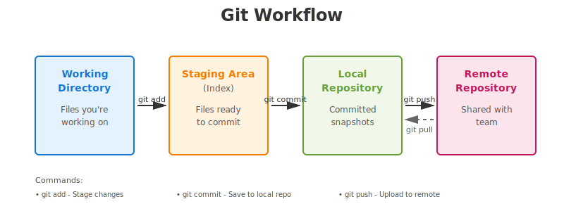

*The image shows the flow from Working Directory → Staging Area → Local Repository → Remote Repository*

---

## Repository Setup

### Initializing a New Repository

```bash
# Initialize the repository
git init

# Set the main branch
git branch -M main

# Add remote origin
git add origin <repository-url>

# Add files to staging
git add .

# Commit to local repository
git commit -m "Initial commit"

# Push to central repository
git push -u origin main
```

### Cloning an Existing Repository

```bash
# Clone a repository
git clone <repository-url>

# Pull latest changes
git pull origin main
```

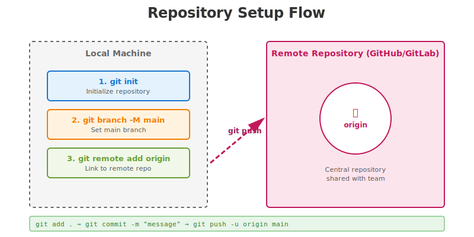

*The image illustrates the process of initializing a repo, setting up remote origin, and the relationship between local and remote repositories*

---

## Branching

### Why Use Branches?

- **Production code** points to the **main branch**
- **Never develop directly** on the main branch
- Create feature branches for development and testing
- Merge to main only after successful testing

### Creating and Working with Branches

```bash
# Create and switch to a new branch
git checkout -b <branch-name>

# Or using newer syntax
git switch -c <branch-name>
```

### Branch Workflow

1. Create a new branch from main
2. Develop and test in the feature branch
3. Run CI/CD pipelines
4. If successful, raise a Pull Request (PR) to main
5. Merge after code review

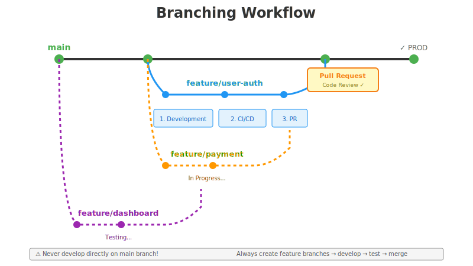

*The image shows the main branch with multiple feature branches diverging and converging back through pull requests*

---

## Merge vs Rebase

Understanding the difference between merge and rebase is crucial for maintaining clean Git history.

### Merge

- Creates an **extra commit** called a **merge commit**
- Merge commit has **2 parents**
- **Preserves complete history** of all commits
- Best for **shared/public branches**

```bash
git checkout main
git merge feature-branch
```

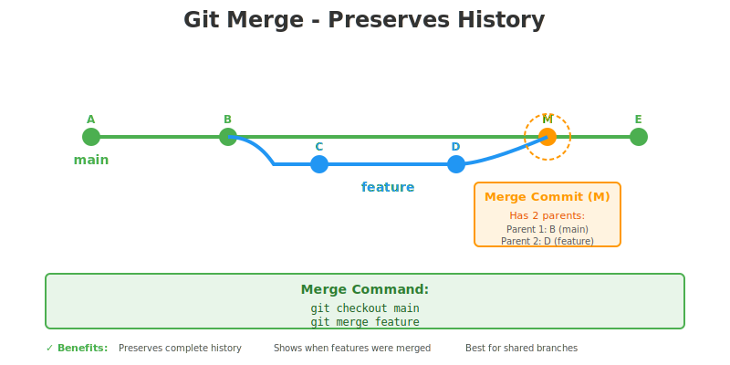

*The image demonstrates how merge creates a merge commit with two parent commits, preserving the complete history of both branches*

### Rebase

- **Does NOT create extra commits**
- **Rewrites history** by changing commit IDs
- Creates a **linear history**
- Best for **private/local branches**

```bash
git checkout feature-branch
git rebase main
```

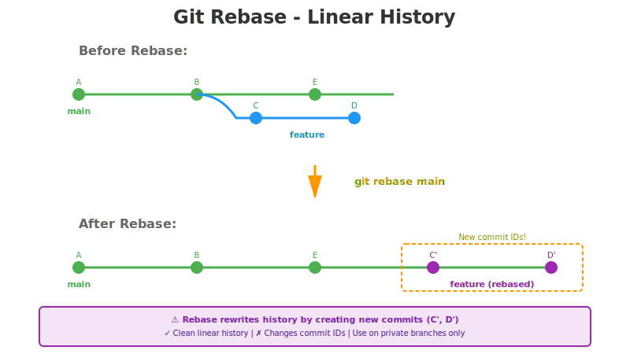

*The image shows how rebase linearizes history by replaying commits from the feature branch on top of the main branch*

### When to Use Which?

| Scenario | Recommendation |
|----------|---------------|
| Shared/public branches | **Merge** |
| Private/local branches | **Rebase** |
| Want to preserve complete history | **Merge** |
| Want clean, linear history | **Rebase** |

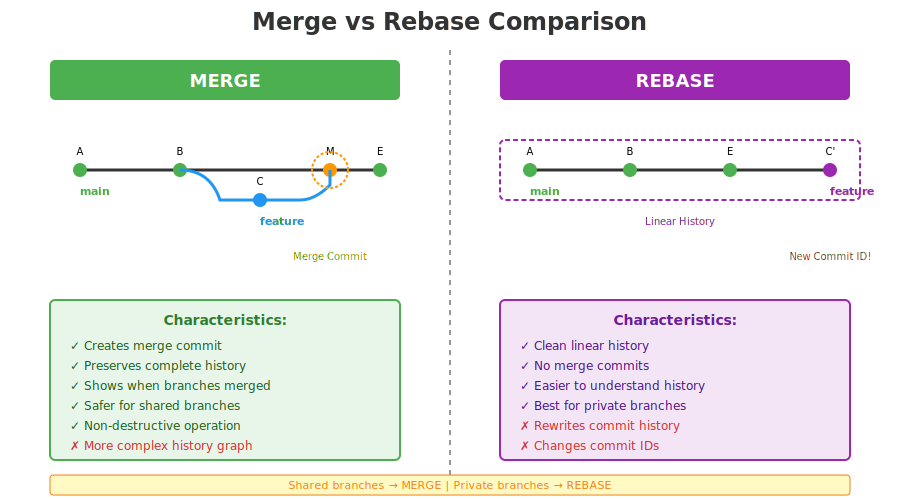

*Side-by-side comparison showing the different commit histories created by merge and rebase operations*

---

## Handling Conflicts

### How Conflicts Occur

Conflicts happen when:
- Two developers modify the **same line** in the **same file**
- Git cannot determine which change to keep
- Manual intervention is required

**Example Scenario:**
Two developers both started working on "egg-dosa" feature and modified the same lines of code.

### Resolving Conflicts

1. Git marks the conflicting areas in the file
2. Developers who made the changes should **sit together**
3. Decide which changes to **keep** and which to **discard**
4. Manually edit the file to resolve conflicts
5. Add and commit the resolved file

```bash
# After resolving conflicts in the file
git add <resolved-file>
git commit -m "Resolved merge conflicts"
```

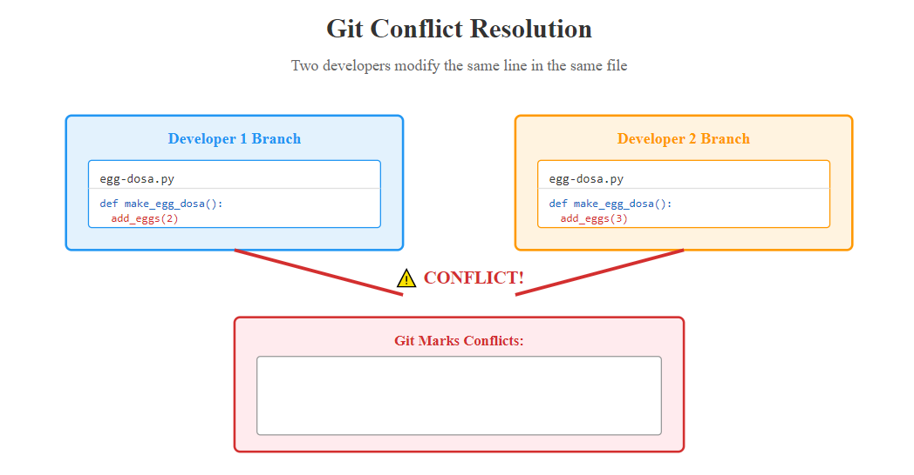

*The image illustrates two branches with conflicting changes and the process of resolving them*

---

## Branching Strategies

Different teams use different branching strategies based on their development workflow.

### 1. Git Model (Git Flow)

A comprehensive branching strategy with multiple branch types.

#### Branch Types:

**Long-lived Branches:**
- `main` - Production-ready code
- `develop` - Integration branch for features

**Short-lived Branches:**
- `feature/*` - New features
- `release/*` - Release preparation
- `hotfix/*` - Production bug fixes
- `bugfix/*` - Development bug fixes

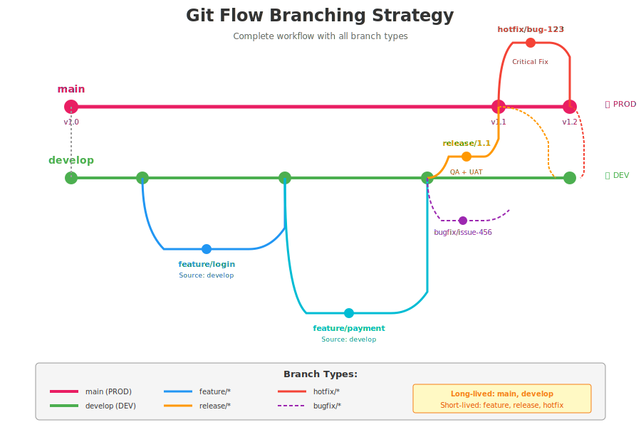

*Comprehensive diagram showing all branch types and their interactions in Git Flow*

#### Branch Details:

**Main Branch**
- Production code
- Tagged releases
- Only receives merges from release and hotfix branches

**Develop Branch**
- Source: `main`
- All development changes are reflected here
- Target for feature branches
- Deployed to DEV environment

**Feature Branch**
- Source: `develop`
- Target: `develop` (through Pull Request)
- Naming: `feature/<feature-name>`
- Deleted after merge

**Release Branch**
- Source: `develop`
- For QA and UAT testing
- Bug fixes go directly to release branch
- Target: Both `main` (for PROD) and `develop`
- Tagged when merged to main

**Hotfix Branch**
- Source: `main`
- For critical production fixes
- Naming: `hotfix/bug-1234`
- Deployed to DEV for testing
- Target: Both `main` and `develop`

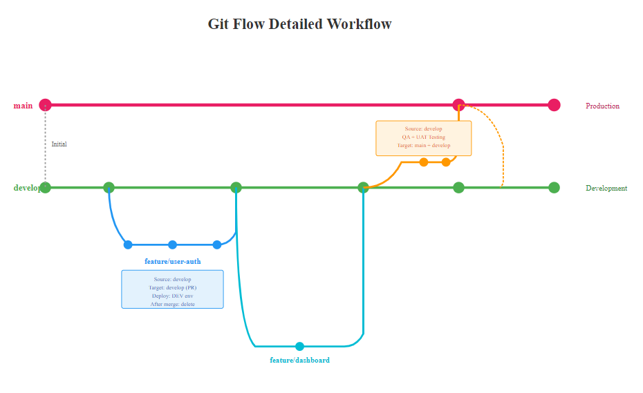

*Detailed workflow showing how each branch type interacts with others*

**Best For:** Waterfall model development, software with multiple versions, multiple device support

---

### 2. GitHub Flow (Feature Branching Model)

A simplified branching strategy with only main and feature branches.

#### Characteristics:

- Only **main** branch is long-lived
- All features branch directly from **main**
- One feature = One developer (typically)
- CI pipeline runs on feature branch
- After approval, merge to main
- Same code deploys to all environments

```
main → feature → CI/CD → main → DEV → UAT → SIT → PROD
```

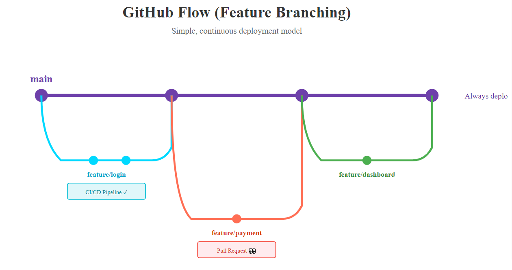

*Simple diagram showing feature branches created from and merged back to main*

#### Environment Strategy:

- **Don't create branches for environments** (dev, uat, qa, prod)
- Use the **same codebase** across all environments
- Only **configuration changes** between environments
- What's tested in DEV goes all the way to PROD

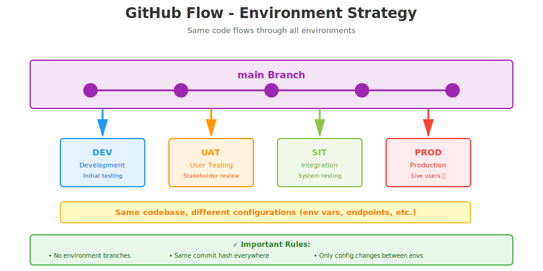

*Diagram showing how the same code flows through different environments*

**Best For:** Continuous deployment, agile teams, single production version

---

### 3. Trunk-Based Development

The simplest branching strategy.

- Only **main** branch (the "trunk")
- Very short-lived feature branches (hours, not days)
- Frequent integration to main
- Heavy reliance on feature flags

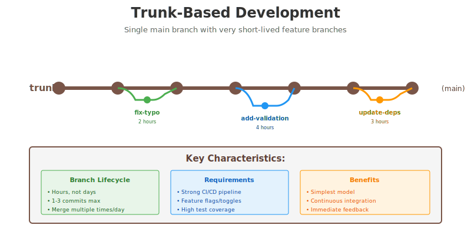

*Diagram showing trunk-based development with very short-lived branches*

**Best For:** Highly mature teams, strong CI/CD, continuous deployment

---

## Git Reset

Used to undo changes in Git. Three modes available:

### 1. Soft Reset

```bash
git reset --soft HEAD~1
```

- Undoes the commit
- Changes move to **staging area**
- Files remain modified and staged
- Ready to commit again

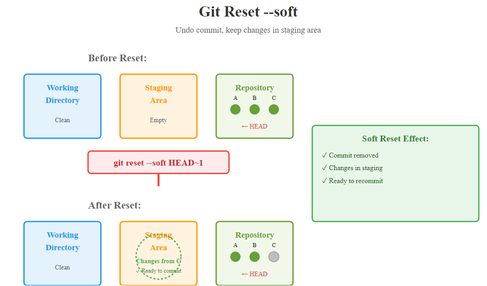

*Diagram showing commit being undone with changes moved to staging area*

### 2. Mixed Reset (Default)

```bash
git reset HEAD~1
# or
git reset --mixed HEAD~1
```

- Undoes the commit
- Changes move to **working directory**
- Files remain modified but unstaged
- Need to `git add` before committing

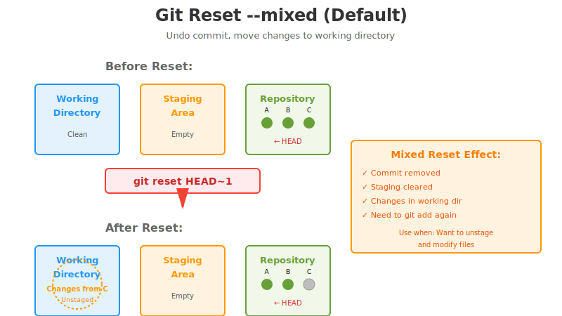

*Diagram showing commit being undone with changes moved to working directory*

### 3. Hard Reset

```bash
git reset --hard HEAD~1
```

- Undoes the commit
- **Discards all changes permanently**
- Working directory is cleaned
- ⚠️ **Warning:** Cannot be recovered!

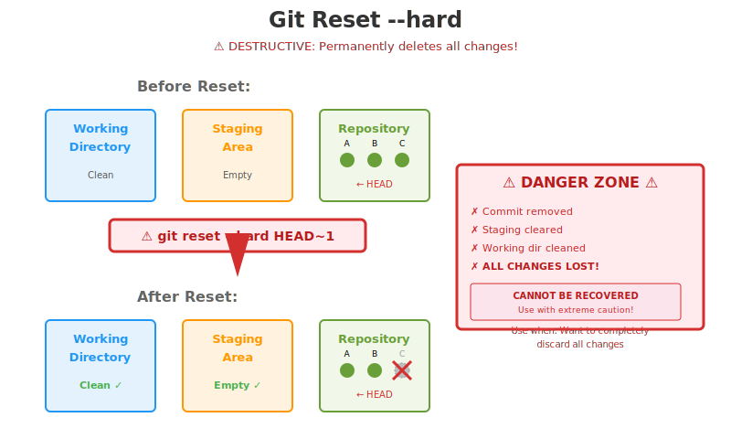

*Diagram showing commit being completely removed with all changes discarded*

### Reset Comparison

| Reset Type | Commit | Staging Area | Working Directory |
|------------|--------|--------------|-------------------|
| `--soft` | ✗ Removed | ✓ Preserved | ✓ Preserved |
| `--mixed` | ✗ Removed | ✗ Cleared | ✓ Preserved |
| `--hard` | ✗ Removed | ✗ Cleared | ✗ Cleared |

---

## Best Practices for DevOps

1. **Always use branches** - Never commit directly to main
2. **Pull before push** - Always sync with remote before pushing
3. **Write meaningful commit messages** - Explain what and why
4. **Use Pull Requests** - Enable code review and discussion
5. **Automate testing** - Run CI/CD on every branch
6. **Choose the right strategy** - Match branching strategy to your workflow
7. **Merge shared branches** - Use merge for collaboration
8. **Rebase private branches** - Keep your local work clean
9. **Resolve conflicts early** - Don't let them accumulate
10. **Tag releases** - Mark important milestones

---

## Quick Reference

### Common Commands

```bash
# Check status
git status

# Create branch
git checkout -b feature/new-feature

# Add changes
git add .

# Commit
git commit -m "Description of changes"

# Push to remote
git push origin feature/new-feature

# Pull latest changes
git pull origin main

# Merge branch
git checkout main
git merge feature/new-feature

# Rebase branch
git checkout feature/new-feature
git rebase main

# View commit history
git log --oneline --graph --all

# Undo last commit (soft)
git reset --soft HEAD~1
```

---

## Additional Resources

- [Official Git Documentation](https://git-scm.com/doc)
- [Atlassian Git Tutorials](https://www.atlassian.com/git/tutorials)
- [GitHub Flow Guide](https://guides.github.com/introduction/flow/)
- [Git Flow Guide](https://nvie.com/posts/a-successful-git-branching-model/)

---

## Contributing

When contributing to this guide:
1. Create a feature branch
2. Make your changes
3. Ensure all examples work
4. Submit a Pull Request

---

**Last Updated:** February 2026  
**Maintained by:** Velanati Naveen Kumar
